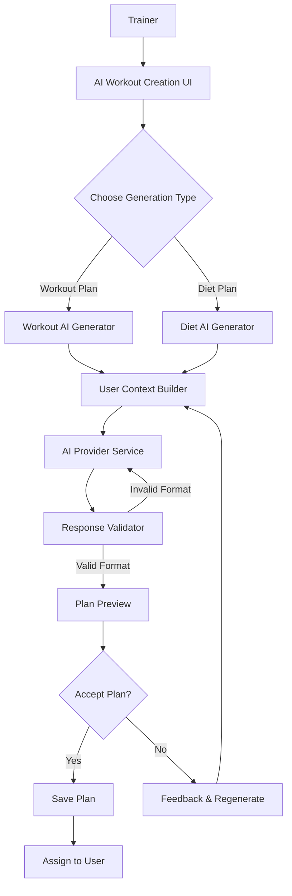

# AI-Powered Workout & Diet Planning Architecture

## Overview

This architecture enables trainers to generate personalized workout and diet plans for their clients using AI. The system integrates with the existing workout assignment flow while adding AI capabilities that understand client health profiles and fitness goals.

## Architecture Components



## Core Components

### 1. AI Integration Layer

- **AI Service Abstraction**
  - Handles communication with AI providers (Gemini, OpenAI)
  - Implements retry logic and error handling
  - Manages rate limits and token usage

- **Context Builder**
  - Creates detailed prompts with user health data and preferences
  - Transforms application data into structured context for AI

- **Response Validator & Parser**
  - Validates AI responses against JSON schema
  - Handles parsing and transforming AI outputs
  - Implements fallback strategies for invalid responses

### 2. User Interface Components

- **AI Plan Generator Interface**
  - Form for entering plan parameters (goal, constraints, etc)
  - Preview of generated plan with highlighting of key elements
  - Feedback input for plan adjustments

- **Feedback & Iteration System**
  - Interface for trainers to provide feedback on generated plans
  - Stores conversation history for context persistence

## Implementation Strategy

### Server Actions Structure

```
/app/dashboard/trainer/workouts/assigncustomworkouts/
├── page.tsx                      # Main page for AI workout creation
├── _components/                  # UI components 
│   ├── ai-workout-form.tsx       # Form for AI workout parameters
│   ├── plan-preview.tsx          # Preview component for AI results
│   ├── feedback-input.tsx        # Component for providing feedback
│   └── context-builder.tsx       # Component for user context
├── _actions/                     # Server actions
│   ├── generate-workout.ts       # Generate workout with AI
│   ├── generate-diet.ts          # Generate diet with AI
│   ├── regenerate-with-feedback.ts # Regenerate with trainer feedback
│   └── save-ai-plan.ts           # Save AI generated plan
└── _lib/                         # Utilities
    ├── ai-service.ts             # AI provider abstraction 
    ├── schema-validation.ts      # JSON schema validation
    └── prompt-templates.ts       # AI prompt templates
```

## JSON Schema Enforcement Techniques

### 1. Schema-Directed Prompting

The most reliable technique with Gemini and other LLMs is detailed schema-directed prompting:

```typescript
function buildStructuredPrompt(userProfile, parameters) {
  return `
    Generate a personalized workout plan for a client with the following details:
    - Age: ${userProfile.age}
    - Gender: ${userProfile.gender}
    - Weight: ${userProfile.weight} kg
    - Height: ${userProfile.height} cm
    - Fitness goal: ${userProfile.goal}
    - Available equipment: ${parameters.equipment}
    
    RESPONSE FORMAT:
    You must respond with a valid JSON object that strictly follows this schema:
    {
      "name": "Name of the workout plan",
      "description": "Brief overview of the plan",
      "schedules": [
        {
          "dayOfWeek": "Monday", // Must be a valid day of week
          "muscleTarget": "Chest & Triceps", // Muscle group targeted
          "duration": 60, // Duration in minutes (number)
          "calories": 350, // Estimated calories burned (number)
          "exercises": [
            {
              "name": "Bench Press", // Exercise name
              "sets": 3, // Number of sets (number)
              "reps": "8-10", // Repetition range (string)
              "description": "Instructions for the exercise",
              "order": 1 // Exercise order (number)
            }
            // Include 4-8 exercises per day
          ]
        }
        // Include schedules for each training day
      ]
    }
    
    IMPORTANT:
    1. Respond ONLY with the JSON. No introduction or explanations.
    2. Ensure all required fields are included and properly typed.
    3. Do not include any properties not defined in the schema.
    4. Make the plan realistic and suitable for the client's profile.
  `;
}
```

### 2. Post-Processing & Validation

Even with the best prompts, validation is essential:

```typescript
import { z } from 'zod';

// Define the schema using Zod
const ExerciseSchema = z.object({
  name: z.string(),
  sets: z.number(),
  reps: z.string(),
  description: z.string(),
  order: z.number()
});

const WorkoutScheduleSchema = z.object({
  dayOfWeek: z.enum(["Monday", "Tuesday", "Wednesday", "Thursday", "Friday", "Saturday", "Sunday"]),
  muscleTarget: z.string(),
  duration: z.number(),
  calories: z.number(),
  exercises: z.array(ExerciseSchema)
});

const WorkoutPlanSchema = z.object({
  name: z.string(),
  description: z.string(),
  schedules: z.array(WorkoutScheduleSchema)
});

// Validate AI response against schema
export async function validateAIResponse(response: string) {
  try {
    // Extract JSON from response (AI might wrap it in markdown or text)
    const jsonMatch = response.match(/{[\s\S]*}/);
    if (!jsonMatch) throw new Error("No JSON found in response");
    
    const planData = JSON.parse(jsonMatch[0]);
    
    // Validate with Zod
    const validationResult = WorkoutPlanSchema.safeParse(planData);
    
    if (validationResult.success) {
      return {
        valid: true,
        data: validationResult.data
      };
    } else {
      return {
        valid: false,
        errors: validationResult.error.format(),
        data: planData // Return the original data for potential retry
      };
    }
  } catch (error) {
    return {
      valid: false,
      errors: error.message,
      data: null
    };
  }
}
```

### 3. Retry Strategy

When validation fails, implement a retry strategy:

```typescript
async function generateWithRetry(prompt, maxAttempts = 3) {
  let attempts = 0;
  
  while (attempts < maxAttempts) {
    attempts++;
    
    const response = await generateAIResponse(prompt);
    const validation = await validateAIResponse(response);
    
    if (validation.valid) {
      return validation.data;
    }
    
    // If invalid, create a new prompt that includes error feedback
    prompt = `
      I tried to generate a workout plan but the response had these issues:
      ${JSON.stringify(validation.errors)}
      
      Please generate a new response strictly following this schema:
      ${getSchemaDescription()}
      
      ORIGINAL REQUEST:
      ${prompt}
    `;
  }
  
  throw new Error("Failed to generate valid response after maximum attempts");
}
```

## Technical Implementation with Gemini

### 1. Gemini SDK Integration

```typescript
import { GoogleGenerativeAI, HarmCategory, HarmBlockThreshold } from "@google/generative-ai";

export async function generateWithGemini(prompt: string) {
  const genAI = new GoogleGenerativeAI(process.env.GEMINI_API_KEY!);
  const model = genAI.getGenerativeModel({ model: "gemini-pro" });
  
  const generationConfig = {
    temperature: 0.4, // Lower temperature for more structured outputs
    topK: 32,
    topP: 0.95,
    maxOutputTokens: 4096,
  };
  
  const safetySettings = [
    {
      category: HarmCategory.HARM_CATEGORY_HARASSMENT,
      threshold: HarmBlockThreshold.BLOCK_MEDIUM_AND_ABOVE,
    },
    // Add other safety settings as needed
  ];
  
  try {
    const result = await model.generateContent({
      contents: [{ role: "user", parts: [{ text: prompt }] }],
      generationConfig,
      safetySettings,
    });
    
    return result.response.text();
  } catch (error) {
    console.error("Gemini API error:", error);
    throw new Error("Failed to generate content with Gemini");
  }
}
```

### 2. Server Action Implementation

```typescript
'use server';

import { generateWithGemini } from '../_lib/ai-service';
import { validateAIResponse } from '../_lib/schema-validation';
import { buildWorkoutPrompt } from '../_lib/prompt-templates';
import { getUserProfile } from '../../../_actions/get-user-profile';

export async function generateAIWorkout(userId: string, parameters: any) {
  try {
    // Get user profile data
    const userProfile = await getUserProfile(userId);
    
    // Build prompt with user context
    const prompt = buildWorkoutPrompt(userProfile, parameters);
    
    // Generate workout with retry strategy
    const response = await generateWithGemini(prompt);
    
    // Validate response
    const validation = await validateAIResponse(response);
    
    if (!validation.valid) {
      // If invalid after retries, throw error
      console.error("Invalid AI response:", validation.errors);
      throw new Error("Failed to generate valid workout plan");
    }
    
    return {
      success: true,
      workoutPlan: validation.data,
      rawResponse: response // For debugging
    };
  } catch (error) {
    console.error("Error generating workout plan:", error);
    return {
      success: false,
      error: error.message || "An error occurred while generating the plan"
    };
  }
}
```

### 3. Feedback Loop Implementation

```typescript
'use server';

import { generateWithGemini } from '../_lib/ai-service';
import { validateAIResponse } from '../_lib/schema-validation';

export async function regenerateWithFeedback(originalPlan: any, feedback: string) {
  try {
    const prompt = `
      I created this workout plan:
      ${JSON.stringify(originalPlan, null, 2)}
      
      But I received this feedback:
      "${feedback}"
      
      Please make adjustments to address the feedback while keeping the same JSON structure.
      
      IMPORTANT:
      1. Respond ONLY with the JSON. No introduction or explanations.
      2. Ensure all required fields are included and properly typed.
      3. Keep the same structure but modify the content based on feedback.
    `;
    
    const response = await generateWithGemini(prompt);
    const validation = await validateAIResponse(response);
    
    if (!validation.valid) {
      throw new Error("Failed to generate valid updated workout plan");
    }
    
    return {
      success: true,
      workoutPlan: validation.data
    };
  } catch (error) {
    console.error("Error regenerating workout plan:", error);
    return {
      success: false,
      error: error.message || "An error occurred while updating the plan"
    };
  }
}
```

## Recommended Libraries & Tools

### 1. AI Provider SDKs

- **Google's Generative AI SDK**
  - `npm install @google/generative-ai`
  - Provides direct access to Gemini models
  - Well-documented with TypeScript support

- **OpenAI SDK** (alternative)
  - `npm install openai`
  - Better function calling capabilities, but more expensive

### 2. Schema Validation & Typing

- **Zod**
  - `npm install zod`
  - Runtime schema validation
  - TypeScript integration for type inference
  - Perfect for validating AI responses

- **TypeScript**
  - Strong typing for AI responses
  - Interface definitions that match your database models

### 3. UI Components

- **Shadcn UI** (which you're already using)
  - Great for feedback forms and previews
  - Easily customizable

- **react-markdown**
  - `npm install react-markdown`
  - For rendering formatted instructions or AI responses

### 4. State Management for Feedback Loop

- **React Context** or **Zustand**
  - `npm install zustand` (if choosing Zustand)
  - Maintain conversation history
  - Manage state between generation attempts

## Industry Best Practices for Schema Enforcement

1. **Function Calling / Tools API**
   - OpenAI and Anthropic provide specialized endpoints
   - Most reliable but vendor-specific

2. **Schema-Directed Prompting**
   - Works across all LLMs including Gemini
   - Requires careful prompt engineering
   - Include examples in prompts

3. **Validation & Retry Pattern**
   - Always validate responses regardless of technique
   - Implement retry with error correction
   - Have fallback strategies

4. **Post-Processing Pipeline**
   - Extract JSON from text responses
   - Apply schema validation
   - Transform to match application schemas

5. **Few-Shot Learning**
   - Include 2-3 examples in prompts
   - Show both input context and expected output

## Next Steps

1. Implement the basic AI service with Gemini
2. Create schema validation for workout plans
3. Build the UI for plan generation and feedback
4. Implement the feedback loop mechanism
5. Test with various user profiles and edge cases
6. Add diet plan generation following the same pattern

## Performance Considerations

- **Streaming Responses**
  - Implement streaming for better UX during generation
  - Show typing indicators or partial results

- **Caching**
  - Cache similar requests to reduce API costs
  - Store generation history for quick access

- **Progressive Enhancement**
  - Offer basic template selection as fallback
  - Allow manual editing of generated plans
